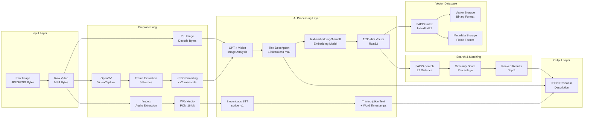

# AI Data Transformations: Technical Deep Dive

## 🔄 Complete Data Flow Through AI Pipeline



---

## 🧬 Detailed AI Transformation Pipeline

### Transformation 1: Image → Text Description

```
┌─────────────────────────────────────────────────────────────┐
│ INPUT: Image Bytes (JPEG/PNG)                               │
│ Size: Variable (KB to MB)                                    │
│ Format: Binary image data                                   │
└────────────────────┬────────────────────────────────────────┘
                     │
                     ▼
┌─────────────────────────────────────────────────────────────┐
│ STEP 1: Image Decoding                                      │
│ PIL.Image.open(BytesIO(image_bytes))                       │
│ Output: PIL Image object                                    │
└────────────────────┬────────────────────────────────────────┘
                     │
                     ▼
┌─────────────────────────────────────────────────────────────┐
│ STEP 2: Base64 Encoding                                     │
│ base64.b64encode(image_bytes)                                │
│ Output: Base64 string                                        │
│ Format: "data:image/jpeg;base64,/9j/4AAQSkZJRg..."          │
└────────────────────┬────────────────────────────────────────┘
                     │
                     ▼
┌─────────────────────────────────────────────────────────────┐
│ STEP 3: AI Model Input Preparation                          │
│ {                                                           │
│   "type": "image_url",                                      │
│   "image_url": {                                            │
│     "url": "data:image/jpeg;base64,..."                    │
│   }                                                         │
│ }                                                           │
└────────────────────┬────────────────────────────────────────┘
                     │
                     ▼
┌─────────────────────────────────────────────────────────────┐
│ STEP 4: GPT-4 Vision Processing                             │
│ Model: gpt-4o                                               │
│ Input: System Prompt + Image                                │
│ Processing:                                                  │
│   - Visual feature extraction                                │
│   - Food recognition                                        │
│   - Ingredient identification                               │
│   - Preparation style analysis                              │
│   - Aroma/flavor inference                                  │
│ Output: Text description (max 1500 tokens)                 │
└────────────────────┬────────────────────────────────────────┘
                     │
                     ▼
┌─────────────────────────────────────────────────────────────┐
│ OUTPUT: Text Description                                    │
│ Format: Natural language string                             │
│ Example:                                                    │
│ "This image shows a grilled beef burger with melted        │
│  cheddar cheese, crisp lettuce, sliced tomatoes, and        │
│  pickles on a toasted sesame seed bun. The patty appears   │
│  to be medium-well done with visible grill marks..."       │
│ Length: ~500-1500 tokens                                    │
└─────────────────────────────────────────────────────────────┘
```

**AI Model Details:**
- **Model**: `gpt-4o` (multimodal)
- **Vision Capability**: Analyzes image content
- **Token Limit**: 1500 tokens output
- **Temperature**: 0 (deterministic responses)
- **Processing Time**: 2-5 seconds per image

---

### Transformation 2: Text Description → Vector Embedding

```
┌─────────────────────────────────────────────────────────────┐
│ INPUT: Text Description                                      │
│ Format: Natural language string                             │
│ Length: ~500-1500 tokens                                    │
│ Example: "Grilled beef burger with cheddar..."             │
└────────────────────┬────────────────────────────────────────┘
                     │
                     ▼
┌─────────────────────────────────────────────────────────────┐
│ STEP 1: API Request Preparation                              │
│ {                                                           │
│   "model": "text-embedding-3-small",                        │
│   "input": "Grilled beef burger with cheddar..."           │
│ }                                                           │
└────────────────────┬────────────────────────────────────────┘
                     │
                     ▼
┌─────────────────────────────────────────────────────────────┐
│ STEP 2: OpenAI Embeddings API Processing                   │
│ Model: text-embedding-3-small                               │
│ Processing:                                                  │
│   - Tokenization                                            │
│   - Neural network encoding                                 │
│   - Semantic feature extraction                             │
│   - Dimensionality: 1536                                    │
│ Output: Vector array (1536 dimensions)                      │
└────────────────────┬────────────────────────────────────────┘
                     │
                     ▼
┌─────────────────────────────────────────────────────────────┐
│ STEP 3: Vector Conversion                                   │
│ np.array(response.data[0].embedding, dtype=np.float32)     │
│ Output: NumPy array                                          │
│ Shape: (1536,)                                               │
│ Data Type: float32                                           │
│ Example: [0.0234, -0.1456, 0.7891, ..., 0.0123]            │
└────────────────────┬────────────────────────────────────────┘
                     │
                     ▼
┌─────────────────────────────────────────────────────────────┐
│ OUTPUT: 1536-Dimensional Vector                             │
│ Format: NumPy array (float32)                               │
│ Properties:                                                  │
│   - Semantic representation of text                          │
│   - Captures meaning, not just words                        │
│   - Similar texts → similar vectors                         │
│   - Ready for similarity search                             │
└─────────────────────────────────────────────────────────────┘
```

**Embedding Model Details:**
- **Model**: `text-embedding-3-small`
- **Dimensions**: 1536
- **Data Type**: float32
- **Semantic Properties**: 
  - Similar meanings → close vectors
  - Cosine similarity or L2 distance for comparison
- **Processing Time**: 0.5-1 second

---

### Transformation 3: Vector → FAISS Index Storage

```
┌─────────────────────────────────────────────────────────────┐
│ INPUT: 1536-dim Vector (float32)                            │
│ Shape: (1536,)                                              │
│ Example: [0.0234, -0.1456, ..., 0.0123]                    │
└────────────────────┬────────────────────────────────────────┘
                     │
                     ▼
┌─────────────────────────────────────────────────────────────┐
│ STEP 1: Reshape for FAISS                                   │
│ embedding.reshape(1, -1)                                    │
│ Output Shape: (1, 1536) - 2D array required by FAISS       │
└────────────────────┬────────────────────────────────────────┘
                     │
                     ▼
┌─────────────────────────────────────────────────────────────┐
│ STEP 2: Add to FAISS Index                                  │
│ faiss_index.add(embedding)                                  │
│ Processing:                                                  │
│   - Append vector to index                                   │
│   - Increment ntotal counter                                │
│   - Store in memory (IndexFlatL2)                           │
│ Output: Index updated (ntotal += 1)                         │
└────────────────────┬────────────────────────────────────────┘
                     │
                     ▼
┌─────────────────────────────────────────────────────────────┐
│ STEP 3: Store Metadata                                      │
│ faiss_metadata.append({                                     │
│   "image_path": "samples/1.jpg",                           │
│   "description": "Grilled beef burger...",                  │
│   "description_variation": 1,                              │
│   "image_index": 123                                        │
│ })                                                          │
│ Output: Metadata list updated                               │
└────────────────────┬────────────────────────────────────────┘
                     │
                     ▼
┌─────────────────────────────────────────────────────────────┐
│ STEP 4: Persistence (on shutdown)                           │
│ faiss.write_index(faiss_index, "faiss_index.bin")          │
│ pickle.dump(faiss_metadata, "faiss_metadata.pkl")           │
│ Output: Binary files on disk                                │
└─────────────────────────────────────────────────────────────┘
```

**FAISS Index Details:**
- **Index Type**: `IndexFlatL2` (exact L2 distance)
- **Storage**: In-memory during runtime, binary file on disk
- **Search Complexity**: O(n) where n = number of vectors
- **Memory**: ~6KB per vector (1536 * 4 bytes)

---

### Transformation 4: Query Vector → Similarity Search

```
┌─────────────────────────────────────────────────────────────┐
│ INPUT: Query Image                                           │
│ Format: Image bytes (JPEG/PNG)                              │
└────────────────────┬────────────────────────────────────────┘
                     │
                     ▼
┌─────────────────────────────────────────────────────────────┐
│ STEP 1: Generate Query Description                          │
│ GPT-4 Vision → Text Description                             │
│ Output: "Grilled beef burger with..."                      │
└────────────────────┬────────────────────────────────────────┘
                     │
                     ▼
┌─────────────────────────────────────────────────────────────┐
│ STEP 2: Generate Query Embedding                           │
│ text-embedding-3-small → 1536-dim Vector                    │
│ Output: query_vector (1, 1536)                               │
└────────────────────┬────────────────────────────────────────┘
                     │
                     ▼
┌─────────────────────────────────────────────────────────────┐
│ STEP 3: FAISS Search                                        │
│ faiss_index.search(query_vector, k=5)                       │
│ Processing:                                                  │
│   - Calculate L2 distance to all vectors                    │
│   - Sort by distance (ascending)                            │
│   - Return top k results                                    │
│ Output: (distances, indices)                                │
│   distances: [0.5, 0.7, 0.9, 1.1, 1.3]                    │
│   indices: [42, 15, 88, 3, 127]                             │
└────────────────────┬────────────────────────────────────────┘
                     │
                     ▼
┌─────────────────────────────────────────────────────────────┐
│ STEP 4: Distance → Similarity Conversion                     │
│ similarity = (1 / (1 + distance)) * 100                     │
│ Examples:                                                    │
│   distance=0.1  → similarity=90.91%                        │
│   distance=0.5  → similarity=66.67%                        │
│   distance=1.0  → similarity=50.00%                        │
│   distance=2.0  → similarity=33.33%                        │
└────────────────────┬────────────────────────────────────────┘
                     │
                     ▼
┌─────────────────────────────────────────────────────────────┐
│ STEP 5: Load Metadata for Results                          │
│ For each index:                                             │
│   - Load description from metadata                          │
│   - Load image_path                                         │
│   - Attach similarity score                                │
│ Output: Ranked results with metadata                        │
└────────────────────┬────────────────────────────────────────┘
                     │
                     ▼
┌─────────────────────────────────────────────────────────────┐
│ OUTPUT: Search Results                                      │
│ [                                                            │
│   {                                                         │
│     "rank": 1,                                              │
│     "image_path": "samples/42.jpg",                         │
│     "description": "Grilled beef burger...",                │
│     "similarity_percentage": 90.91,                         │
│     "distance": 0.1                                         │
│   },                                                        │
│   ...                                                       │
│ ]                                                           │
└─────────────────────────────────────────────────────────────┘
```

---

### Transformation 5: Video → Multi-Modal Analysis

```
┌─────────────────────────────────────────────────────────────┐
│ INPUT: Video File (MP4)                                     │
│ Format: MP4 video bytes                                     │
│ Size: Variable (MB to GB)                                  │
└───────────────┬───────────────────────┬──────────────────────┘
                │                       │
                ▼                       ▼
    ┌───────────────────────┐   ┌───────────────────────┐
    │ VISUAL PATH           │   │ AUDIO PATH            │
    └───────────────────────┘   └───────────────────────┘
                │                       │
                ▼                       ▼
┌─────────────────────────────────────────────────────────────┐
│ VISUAL: Frame Extraction                                    │
│ OpenCV VideoCapture                                          │
│ - Get total_frames, fps, duration                           │
│ - Calculate evenly-spaced indices                           │
│ - Extract 5 key frames                                      │
│ Output: 5 frame images (JPEG)                              │
└────────────────────┬────────────────────────────────────────┘
                    │
                    ▼
┌─────────────────────────────────────────────────────────────┐
│ VISUAL: Frame Analysis (5x)                                 │
│ For each frame:                                             │
│   GPT-4 Vision → Frame Description                          │
│ Output: 5 frame descriptions with timestamps                 │
└─────────────────────────────────────────────────────────────┘

┌─────────────────────────────────────────────────────────────┐
│ AUDIO: Audio Extraction                                     │
│ ffmpeg subprocess:                                          │
│   - Extract audio track                                      │
│   - Convert to WAV (PCM 16-bit, 44.1kHz, Stereo)           │
│ Output: WAV audio bytes                                      │
└────────────────────┬────────────────────────────────────────┘
                    │
                    ▼
┌─────────────────────────────────────────────────────────────┐
│ AUDIO: Speech-to-Text                                       │
│ ElevenLabs STT API (scribe_v1):                            │
│   - Transcribe audio to text                                │
│   - Generate word-level timestamps                          │
│   - Detect language                                          │
│ Output: Transcription with word timestamps                  │
└────────────────────┬────────────────────────────────────────┘
                    │
                    ▼
┌─────────────────────────────────────────────────────────────┐
│ OUTPUT: Combined Analysis                                   │
│ {                                                           │
│   "frame_analysis": [                                       │
│     {"frame_index": 0, "timestamp": 0.0, "description": "..."}, │
│     ...                                                     │
│   ],                                                        │
│   "audio_transcription": {                                  │
│     "text": "Transcribed text...",                         │
│     "words": [{"text": "word", "start": 0.5, "end": 0.7}], │
│     "language": "en"                                        │
│   }                                                         │
│ }                                                           │
└─────────────────────────────────────────────────────────────┘
```

---

## Data Type Transformations Summary

| Stage | Input Type | Output Type | Transformation |
|-------|------------|-------------|----------------|
| Image Upload | Binary bytes | PIL Image | Decode |
| Image → Description | PIL Image | Base64 string | Encode |
| Image → Description | Base64 + Prompt | Text string | GPT-4 Vision AI |
| Description → Embedding | Text string | 1536-dim vector | Embedding AI |
| Vector → FAISS | NumPy array (1, 1536) | FAISS index entry | Index storage |
| Query → Search | Query vector | (distances, indices) | L2 distance calculation |
| Distance → Similarity | L2 distance | Percentage | Mathematical conversion |
| Video → Frames | MP4 bytes | JPEG frames | OpenCV extraction |
| Video → Audio | MP4 bytes | WAV bytes | ffmpeg extraction |
| Audio → Text | WAV bytes | Text + timestamps | ElevenLabs STT AI |

---

## 🎯 AI Model Input/Output Specifications

### GPT-4 Vision (gpt-4o)

**Input:**
```json
{
  "model": "gpt-4o",
  "messages": [
    {
      "role": "system",
      "content": "You are an expert food analysis assistant..."
    },
    {
      "role": "user",
      "content": [
        {
          "type": "text",
          "text": "Analyze this image..."
        },
        {
          "type": "image_url",
          "image_url": {
            "url": "data:image/jpeg;base64,..."
          }
        }
      ]
    }
  ],
  "max_tokens": 1500,
  "temperature": 0
}
```

**Output:**
```json
{
  "choices": [
    {
      "message": {
        "content": "This image shows a grilled beef burger..."
      }
    }
  ]
}
```

### OpenAI Embeddings (text-embedding-3-small)

**Input:**
```json
{
  "model": "text-embedding-3-small",
  "input": "This image shows a grilled beef burger..."
}
```

**Output:**
```json
{
  "data": [
    {
      "embedding": [0.0234, -0.1456, 0.7891, ..., 0.0123],
      "index": 0
    }
  ],
  "model": "text-embedding-3-small",
  "usage": {
    "prompt_tokens": 150,
    "total_tokens": 150
  }
}
```

### ElevenLabs STT (scribe_v1)

**Input:**
```
POST /v1/speech-to-text
Headers: {"xi-api-key": "..."}
Files: {"file": ("audio.wav", audio_bytes, "audio/wav")}
Data: {"model_id": "scribe_v1"}
```

**Output:**
```json
{
  "text": "This is a delicious burger with cheese...",
  "words": [
    {
      "text": "This",
      "start": 0.0,
      "end": 0.2,
      "type": "word"
    },
    ...
  ],
  "language_code": "en"
}
```

---

## 🔢 Mathematical Operations

### L2 Distance Calculation

```python
# FAISS calculates L2 (Euclidean) distance
distance = sqrt(sum((query_vector[i] - indexed_vector[i])^2 for i in range(1536)))

# Example:
query = [0.1, 0.2, 0.3, ...]
indexed = [0.15, 0.25, 0.35, ...]
distance = sqrt((0.1-0.15)^2 + (0.2-0.25)^2 + ...)
```

### Similarity Percentage Conversion

```python
# Convert L2 distance to similarity percentage
similarity = (1 / (1 + distance)) * 100

# Properties:
# - distance = 0 → similarity = 100% (identical)
# - distance → ∞ → similarity → 0% (completely different)
# - distance = 1 → similarity = 50% (moderate similarity)
```

### Frame Index Calculation

```python
# Calculate evenly-spaced frame indices
total_frames = 1000
num_frames = 5
step = max(1, total_frames // num_frames)  # step = 200
frame_indices = [i * step for i in range(num_frames)]
# Result: [0, 200, 400, 600, 800]
```

---

## ⚡ Performance Characteristics

### Processing Times (Typical)

| Operation | Time | Notes |
|-----------|------|-------|
| Image → Description (GPT-4 Vision) | 2-5s | Depends on image complexity |
| Description → Embedding | 0.5-1s | Fast, cached by OpenAI |
| FAISS Search (1000 vectors) | <10ms | Linear scan |
| Frame Extraction (5 frames) | 1-2s | OpenCV processing |
| Audio Extraction (ffmpeg) | 2-5s | Depends on video length |
| Audio Transcription | 5-15s | ElevenLabs API + retry |

### Memory Usage

| Component | Memory per Item | Notes |
|-----------|----------------|-------|
| Image bytes | Variable | Depends on image size |
| Embedding vector | 6KB | 1536 * 4 bytes (float32) |
| FAISS index (1000 images) | ~30MB | 5 variations = 5000 vectors |
| Metadata entry | ~1-5KB | Depends on description length |
| Video frame (JPEG) | 50-200KB | Compressed |
| Audio (WAV) | Variable | Depends on duration |

---

This diagram shows all AI transformations, data type conversions, and mathematical operations in the backend system.

