# Backend Architecture: Technical Deep Dive

## 🧠 AI-Powered Backend System Architecture


---

## 🔬 Detailed AI Processing Pipelines

### 1. Image Description Generation Pipeline


**Technical Details:**
- **Model**: `gpt-4o` (multimodal)
- **Max Tokens**: 1500
- **Temperature**: 0 (deterministic)
- **Image Format**: Base64 encoded (JPEG/PNG)
- **MIME Type**: Auto-detected from PIL format
- **Prompt Strategy**: System prompt from `prompt.txt` + user instruction

---

### 2. Image Indexing Pipeline (5-Variation Strategy)

```mermaid
flowchart TD
    A[Upload Image] --> B[Parse Index from Filename<br/>e.g., '123_image.jpg' → 123]
    B --> C{Index Already<br/>Exists?}
    C -->|Yes| D[Return Error<br/>Skip Indexing]
    C -->|No| E[Generate 5 Descriptions]
    
    E --> F[Variation 0<br/>Base Description]
    E --> G[Variation 1<br/>Different Perspective]
    E --> H[Variation 2<br/>Alternative Emphasis]
    E --> I[Variation 3<br/>Different Focus]
    E --> J[Variation 4<br/>Unique Angle]
    
    F --> K[OpenAI Vision API]
    G --> K
    H --> K
    I --> K
    J --> K
    
    K --> L[Get Embedding<br/>text-embedding-3-small]
    L --> M[1536-dim Vector<br/>float32]
    M --> N[Reshape: 1x1536]
    N --> O[Add to FAISS Index]
    O --> P[Store Metadata<br/>- image_path<br/>- description<br/>- variation_num<br/>- image_index]
    
    P --> Q[Repeat for 5 Variations]
    Q --> R[Return Success<br/>5 embeddings added]
```



**Technical Implementation:**
```python
# Pseudo-code for indexing
for variation in range(5):
    description = await get_image_description_from_bytes(
        image_bytes, variation=variation
    )
    embedding = await get_embedding(description)  # 1536-dim
    embedding = embedding.reshape(1, -1)  # FAISS requires 2D
    faiss_index.add(embedding)
    metadata.append({
        "image_path": image_path,
        "description": description,
        "description_variation": variation + 1,
        "image_index": parsed_index
    })
```

**Why 5 Variations?**
- Increases search recall (different phrasings match different queries)
- Captures multiple semantic perspectives
- Improves matching for similar but differently described dishes

---

### 3. Semantic Search Pipeline


**Distance → Similarity Conversion:**
```python
# L2 Distance (lower = more similar)
distance = faiss_index.search(query_vector, k=5)

# Convert to similarity percentage
similarity = (1 / (1 + distance)) * 100

# Example:
# distance = 0.5  → similarity = 66.67%
# distance = 0.1  → similarity = 90.91%
# distance = 2.0  → similarity = 33.33%
```

**FAISS Index Details:**
- **Type**: `IndexFlatL2` (exact L2 distance, no approximation)
- **Dimension**: 1536 (matches embedding size)
- **Search Complexity**: O(n) where n = number of indexed vectors
- **Storage**: Binary file (`faiss_index.bin`) + Pickle metadata

---

### 4. Video Analysis Pipeline (Multi-Modal)


**Frame Extraction Algorithm:**
```python
# Calculate evenly-spaced frame indices
total_frames = cap.get(cv2.CAP_PROP_FRAME_COUNT)
fps = cap.get(cv2.CAP_PROP_FPS)
num_frames = 5

step = max(1, total_frames // num_frames)
frame_indices = [i * step for i in range(min(num_frames, total_frames))]

# Extract frames
for frame_idx in frame_indices:
    cap.set(cv2.CAP_PROP_POS_FRAMES, frame_idx)
    ret, frame = cap.read()
    timestamp = frame_idx / fps
```

**Audio Extraction (ffmpeg):**
```bash
ffmpeg -i video.mp4 \
  -vn \                    # No video
  -acodec pcm_s16le \     # PCM 16-bit little-endian
  -ar 44100 \              # Sample rate
  -ac 2 \                  # Stereo
  -y \                     # Overwrite
  audio.wav
```

**ElevenLabs Retry Logic:**
```python
for attempt in range(max_retries + 1):
    try:
        response = requests.post(url, files=files, data=data)
        if response.status_code == 200:
            return response.json()
        elif response.status_code == 429:  # Rate limited
            delay = base_delay * (2 ** attempt)  # Exponential backoff
            time.sleep(delay)
            continue
    except RequestException as e:
        # Retry with exponential backoff
```

---

## 🗄️ FAISS Vector Database Architecture


**FAISS Index Details:**
- **Index Type**: `IndexFlatL2` - Exact L2 distance search
- **Vector Dimension**: 1536 (OpenAI text-embedding-3-small)
- **Data Type**: `float32`
- **Search Method**: Brute force (exact, not approximate)
- **Storage Format**: Binary (FAISS native) + Pickle (metadata)

**Index Operations:**
```python
# Initialize
faiss_index = faiss.IndexFlatL2(1536)

# Add vectors (batch or single)
vectors = np.array([[0.1, 0.2, ...], ...])  # shape: (n, 1536)
faiss_index.add(vectors)

# Search
query = np.array([[0.15, 0.25, ...]])  # shape: (1, 1536)
distances, indices = faiss_index.search(query, k=5)
# distances: [[0.5, 0.7, 0.9, 1.1, 1.3]]
# indices: [[42, 15, 88, 3, 127]]
```

---

## 🔄 Complete Request Flow: Image Search


---

## 🎬 Video Analysis: Technical Deep Dive


**Video Processing Technical Details:**

1. **Frame Extraction:**
   - Uses OpenCV `VideoCapture`
   - Seeks to specific frame indices
   - Encodes frames as JPEG (compressed)
   - Maintains timestamp accuracy

2. **Audio Extraction:**
   - ffmpeg subprocess call
   - Converts to uncompressed WAV
   - Standard format: PCM 16-bit, 44.1kHz, Stereo
   - Temporary file cleanup after processing

3. **Error Handling:**
   - Video errors: Return partial results
   - Audio errors: Continue without transcription
   - API rate limits: Exponential backoff (2s, 4s, 8s)
   - Network errors: Retry up to 3 times

---

## 🧪 AI Model Specifications

### OpenAI GPT-4 Vision (gpt-4o)
```
Model: gpt-4o
Input: 
  - Text prompt (system + user)
  - Image (base64 encoded, JPEG/PNG)
Output: 
  - Text description (max 1500 tokens)
  - Temperature: 0 (deterministic)
  - Response Format: JSON-compatible text
```

### OpenAI Embeddings (text-embedding-3-small)
```
Model: text-embedding-3-small
Input: Text string (description)
Output: 
  - Vector: 1536 dimensions
  - Data Type: float32
  - Normalized: No (raw embeddings)
  - Usage: Semantic similarity search
```

### ElevenLabs Speech-to-Text (scribe_v1)
```
Model: scribe_v1
Input: 
  - Audio file (WAV format)
  - Sample rate: 44100 Hz
  - Channels: Stereo (2)
  - Encoding: PCM 16-bit
Output:
  - Transcription text
  - Word-level timestamps
  - Language code
  - Confidence scores (if available)
```

---

## 📊 Performance Characteristics

### Latency Breakdown (Typical)

| Operation | Time | Notes |
|-----------|------|-------|
| Image Description (GPT-4 Vision) | 2-5s | Depends on image complexity |
| Embedding Generation | 0.5-1s | Fast, cached by OpenAI |
| FAISS Search (1000 vectors) | <10ms | Linear scan, very fast |
| Frame Extraction (5 frames) | 1-2s | OpenCV processing |
| Audio Extraction (ffmpeg) | 2-5s | Depends on video length |
| Audio Transcription | 5-15s | ElevenLabs API + retry logic |

### Scalability Considerations

- **FAISS Index**: 
  - Current: Linear search O(n)
  - Limit: ~1M vectors before performance degrades
  - Future: Switch to `IndexIVFFlat` for approximate search

- **API Rate Limits**:
  - OpenAI: Varies by tier (requests/min)
  - ElevenLabs: Rate limited (429 errors handled)

- **Memory Usage**:
  - FAISS index: ~6KB per vector (1536 * 4 bytes)
  - 1000 images = ~30MB (5 variations each = 5000 vectors)

---

## 🔐 Error Handling & Resilience


**Retry Strategy:**
- **OpenAI**: No explicit retry (FastAPI handles)
- **ElevenLabs**: 3 retries with exponential backoff
- **ffmpeg**: Single attempt (local process)
- **FAISS**: No retry needed (local operation)

---

## 🗂️ Data Structures

### FAISS Metadata Entry
```python
{
    "image_path": "samples/1.jpg",
    "description": "Detailed food description...",
    "description_variation": 1,  # 1-5
    "image_index": 123  # Optional, parsed from filename
}
```

### Video Analysis Response
```python
{
    "video_filename": "burger.mp4",
    "frame_analysis": [
        {
            "frame_index": 0,
            "timestamp": 0.0,
            "description": "Frame description..."
        }
    ],
    "audio_transcription": {
        "text": "Transcribed text...",
        "words": [
            {"text": "word", "start": 0.5, "end": 0.7}
        ],
        "language": "en"
    },
    "summary": {
        "frames_analyzed": 5,
        "has_audio_transcription": true,
        "processing_time_seconds": 45.2
    }
}
```

---

## 🔧 Configuration & Environment

```python
# Environment Variables
OPENAI_API_KEY=sk-...          # Required
ELEVENLABS_API_KEY=...         # Optional

# FAISS Configuration
EMBEDDING_DIM = 1536
FAISS_INDEX_FILE = "faiss_index.bin"
FAISS_METADATA_FILE = "faiss_metadata.pkl"

# Video Processing
NUM_FRAMES = 5                  # Frames to extract
AUDIO_SAMPLE_RATE = 44100       # Hz
AUDIO_CHANNELS = 2              # Stereo

# API Settings
MAX_TOKENS = 1500               # GPT-4 Vision
TEMPERATURE = 0                 # Deterministic
MAX_RETRIES = 3                 # ElevenLabs
BASE_DELAY = 2.0                # Seconds
```

---

This architecture provides a production-ready AI-powered backend with robust error handling, efficient vector search, and multi-modal video analysis capabilities.

