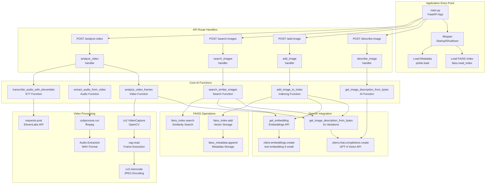
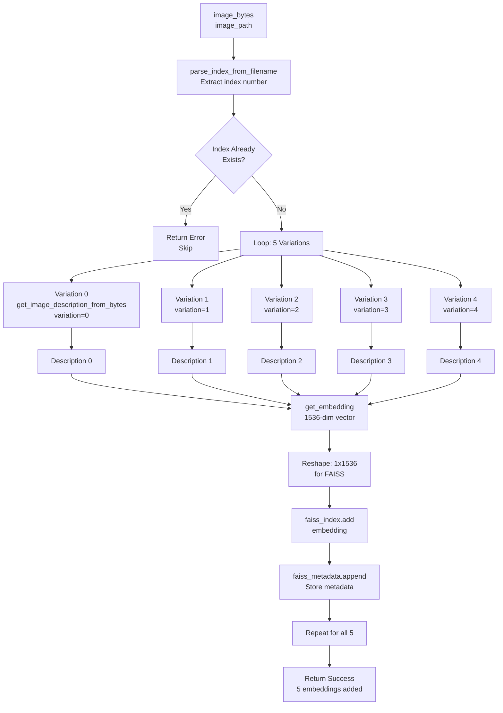
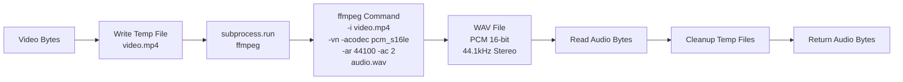
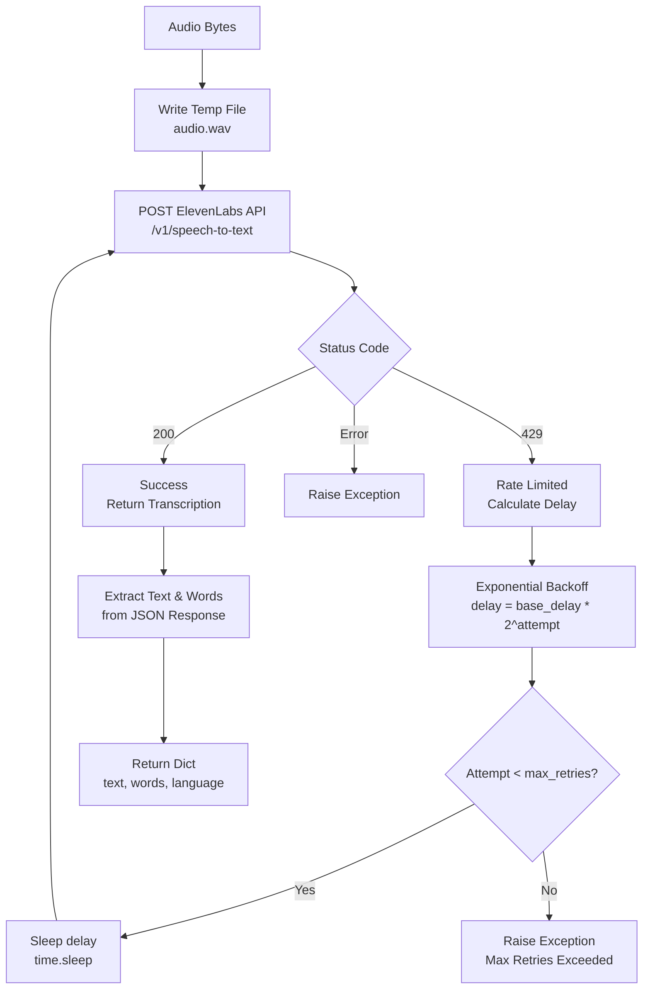
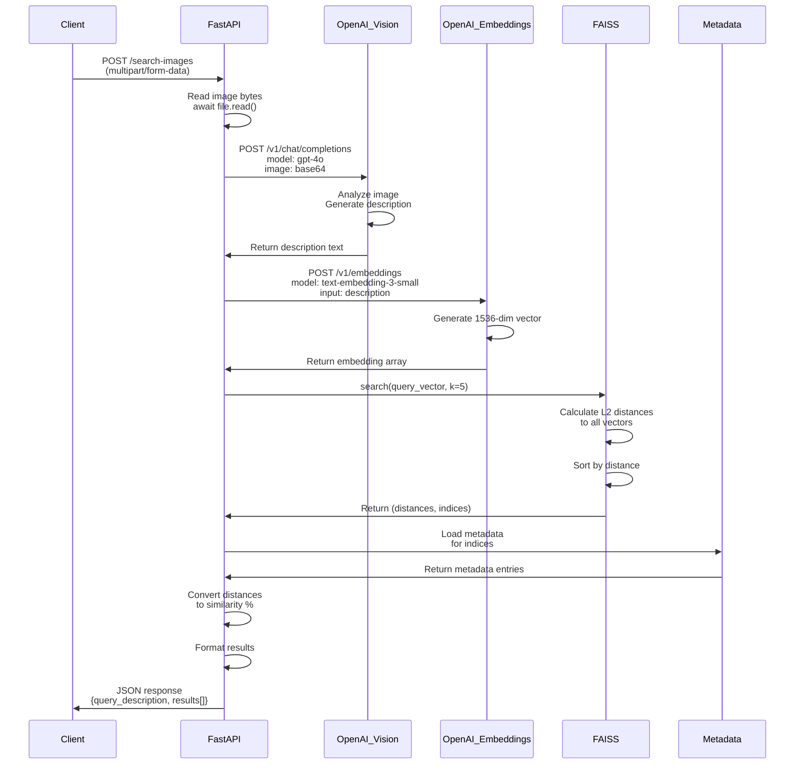
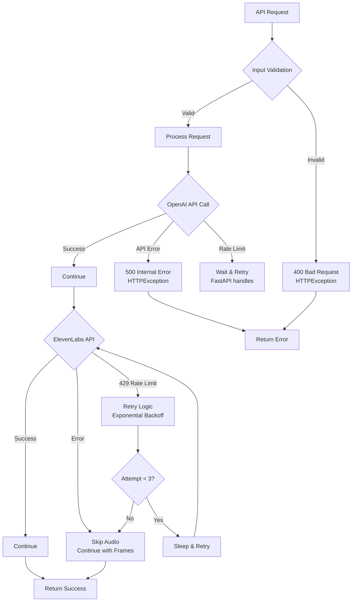

# Backend Code Flow: Function-Level Technical Diagram

## Function Call Hierarchy & AI Integration Points



---

## Detailed Function Specifications

### 1. Image Description Function (AI Core)

```python
async def get_image_description_from_bytes(
    image_bytes: bytes, 
    variation: int = 0
) -> str:
    """
    AI Function: Generate food description using GPT-4 Vision
    
    Flow:
    1. Load prompt.txt (system prompt)
    2. Convert image bytes → PIL Image
    3. Encode image → base64
    4. Call OpenAI Vision API
    5. Return description text
    
    AI Model: gpt-4o
    Max Tokens: 1500
    Temperature: 0 (deterministic)
    """
```

**Code Flow:**
```mermaid
flowchart LR
    A[image_bytes] --> B[PIL Image.open<br/>BytesIO]
    B --> C[Image Format Detection]
    C --> D[Encode to Base64<br/>base64.b64encode]
    D --> E[Load prompt.txt<br/>System Prompt]
    E --> F[OpenAI API Call<br/>client.chat.completions.create]
    F --> G[model: gpt-4o<br/>messages: system + user<br/>content: text + image_url]
    G --> H[Response.choices[0]<br/>.message.content]
    H --> I[Return Description<br/>String]
```

**AI API Call Structure:**
```python
response = client.chat.completions.create(
    model="gpt-4o",
    messages=[
        {
            "role": "system",
            "content": system_prompt  # From prompt.txt
        },
        {
            "role": "user",
            "content": [
                {
                    "type": "text",
                    "text": user_prompt
                },
                {
                    "type": "image_url",
                    "image_url": {
                        "url": f"data:image/{mime_type};base64,{image_base64}"
                    }
                }
            ]
        }
    ],
    max_tokens=1500,
    temperature=0
)
```

---

### 2. Embedding Generation Function

```python
async def get_embedding(text: str) -> np.ndarray:
    """
    AI Function: Convert text to vector embedding
    
    Flow:
    1. Call OpenAI Embeddings API
    2. Extract embedding vector
    3. Convert to numpy array (float32)
    4. Return 1536-dim vector
    
    AI Model: text-embedding-3-small
    Dimension: 1536
    """
```

**Code Flow:**
```mermaid
flowchart LR
    A[Description Text] --> B[client.embeddings.create<br/>model: text-embedding-3-small]
    B --> C[Response.data[0]<br/>.embedding]
    C --> D[np.array<br/>dtype=float32]
    D --> E[1536-dim Vector<br/>Return]
```

**Embedding API Call:**
```python
response = client.embeddings.create(
    model="text-embedding-3-small",
    input=text
)
embedding = np.array(
    response.data[0].embedding, 
    dtype=np.float32
)  # Shape: (1536,)
```

---

### 3. Image Indexing Function (5-Variation Strategy)

```python
async def add_image_to_index(
    image_bytes: bytes, 
    image_path: str = None
) -> dict:
    """
    AI Function: Add image to FAISS index with 5 variations
    
    Flow:
    1. Parse index from filename (optional)
    2. Check if already indexed
    3. Generate 5 descriptions (variations 0-4)
    4. For each description:
       a. Generate embedding
       b. Add to FAISS index
       c. Store metadata
    5. Return success with count
    
    AI Calls: 5x GPT-4 Vision + 5x Embeddings = 10 API calls
    """
```

**Detailed Flow:**


**Code Implementation:**
```python
# Generate 5 different descriptions
descriptions = []
for i in range(5):
    description = await get_image_description_from_bytes(
        image_bytes, variation=i
    )
    descriptions.append(description)

# Add each description separately to the index
for i, description in enumerate(descriptions):
    # Get embedding for description
    embedding = await get_embedding(description)
    
    # Reshape for FAISS (needs to be 2D array)
    embedding = embedding.reshape(1, -1)  # (1, 1536)
    
    # Add to FAISS index
    faiss_index.add(embedding)
    
    # Store metadata
    metadata_entry = {
        "image_path": image_path or "uploaded",
        "description": description,
        "description_variation": i + 1,
    }
    if image_index is not None:
        metadata_entry["image_index"] = image_index
    
    faiss_metadata.append(metadata_entry)
```

---

### 4. Semantic Search Function

```python
async def search_similar_images(
    image_bytes: bytes, 
    top_k: int = 5
) -> dict:
    """
    AI Function: Search for similar images using semantic search
    
    Flow:
    1. Generate description of query image (GPT-4 Vision)
    2. Generate embedding of description
    3. Search FAISS index for similar vectors
    4. Convert distances to similarity percentages
    5. Return top-k results with metadata
    
    AI Calls: 1x GPT-4 Vision + 1x Embeddings = 2 API calls
    """
```

**Search Flow:**
```mermaid
flowchart TD
    A[Query Image Bytes] --> B[get_image_description_from_bytes<br/>Generate Description]
    B --> C[Query Description Text]
    C --> D[get_embedding<br/>Generate Vector]
    D --> E[1536-dim Query Vector]
    E --> F[Reshape: 1x1536<br/>for FAISS]
    F --> G[faiss_index.search<br/>query_vector, k=5]
    G --> H[Return: distances[], indices[]]
    H --> I[Load Metadata<br/>for each index]
    I --> J[Calculate Similarity %<br/>1 / 1+distance * 100]
    J --> K[Sort by Similarity]
    K --> L[Return Top 5 Results<br/>with descriptions]
```

**Similarity Calculation:**
```python
# Search in FAISS
distances, indices = faiss_index.search(
    query_embedding, min(top_k, faiss_index.ntotal)
)

# Convert distances to similarity percentages
results = []
for i, (distance, idx) in enumerate(zip(distances[0], indices[0])):
    if idx < len(faiss_metadata):
        similarity = (1 / (1 + distance)) * 100
        results.append({
            "rank": i + 1,
            "image_path": faiss_metadata[idx]["image_path"],
            "description": faiss_metadata[idx]["description"],
            "similarity_percentage": round(similarity, 2),
            "distance": float(distance),
        })
```

---

### 5. Video Frame Analysis Function

```python
async def analyze_video_frames(
    video_bytes: bytes, 
    num_frames: int = 5
) -> List[Dict]:
    """
    AI Function: Extract and analyze key frames from video
    
    Flow:
    1. Write video to temp file
    2. Open with OpenCV VideoCapture
    3. Get video properties (frames, fps, duration)
    4. Calculate evenly-spaced frame indices
    5. For each frame:
       a. Extract frame
       b. Encode as JPEG
       c. Analyze with GPT-4 Vision
       d. Store description with timestamp
    6. Return frame descriptions
    
    AI Calls: 5x GPT-4 Vision = 5 API calls
    """
```

**Frame Extraction Flow:**
```mermaid
flowchart TD
    A[Video Bytes] --> B[Write Temp File<br/>.mp4]
    B --> C[cv2.VideoCapture<br/>Open Video]
    C --> D[Get Properties<br/>CAP_PROP_FRAME_COUNT<br/>CAP_PROP_FPS]
    D --> E[Calculate Frame Indices<br/>Evenly Spaced]
    E --> F[Loop: 5 Frames]
    
    F --> G[cap.set<br/>CAP_PROP_POS_FRAMES]
    G --> H[cap.read<br/>Extract Frame]
    H --> I[cv2.imencode<br/>'.jpg', frame]
    I --> J[Frame Bytes<br/>JPEG]
    J --> K[get_image_description_from_bytes<br/>AI Analysis]
    K --> L[Frame Description]
    L --> M[Store: index, timestamp, description]
    
    M --> N[Next Frame]
    N --> F
    F -->|Complete| O[Return Frame Descriptions<br/>List[Dict]]
```

**Frame Extraction Code:**
```python
# Open video with OpenCV
cap = cv2.VideoCapture(video_path)

# Get video properties
total_frames = int(cap.get(cv2.CAP_PROP_FRAME_COUNT))
fps = cap.get(cv2.CAP_PROP_FPS)
duration = total_frames / fps if fps > 0 else 0

# Calculate evenly-spaced frame indices
step = max(1, total_frames // num_frames)
frame_indices = [i * step for i in range(min(num_frames, total_frames))]

# Extract and analyze frames
frame_descriptions = []
for frame_idx in frame_indices:
    cap.set(cv2.CAP_PROP_POS_FRAMES, frame_idx)
    ret, frame = cap.read()
    
    if not ret:
        continue
    
    # Convert frame to image bytes
    _, buffer = cv2.imencode('.jpg', frame)
    frame_bytes = buffer.tobytes()
    
    # Get description using OpenAI Vision API
    description = await get_image_description_from_bytes(frame_bytes)
    timestamp = frame_idx / fps if fps > 0 else 0
    
    frame_descriptions.append({
        "frame_index": frame_idx,
        "timestamp": round(timestamp, 2),
        "description": description
    })
```

---

### 6. Audio Extraction Function

```python
async def extract_audio_from_video(
    video_bytes: bytes
) -> bytes:
    """
    Audio Function: Extract audio from video using ffmpeg
    
    Flow:
    1. Write video to temp file
    2. Run ffmpeg subprocess
    3. Extract audio to WAV format
    4. Read audio bytes
    5. Clean up temp files
    6. Return audio bytes
    
    Format: PCM 16-bit, 44.1kHz, Stereo
    """
```

**Audio Extraction Flow:**


**ffmpeg Command:**
```python
cmd = [
    "ffmpeg",
    "-i", video_path,
    "-vn",  # No video
    "-acodec", "pcm_s16le",  # PCM 16-bit little-endian
    "-ar", "44100",  # Sample rate
    "-ac", "2",  # Stereo
    "-y",  # Overwrite output
    audio_path
]

result = subprocess.run(
    cmd,
    stdout=subprocess.PIPE,
    stderr=subprocess.PIPE,
    text=True
)
```

---

### 7. Audio Transcription Function (ElevenLabs STT)

```python
async def transcribe_audio_with_elevenlabs(
    audio_bytes: bytes, 
    max_retries: int = 3, 
    base_delay: float = 2.0
) -> Dict:
    """
    AI Function: Transcribe audio using ElevenLabs STT API
    
    Flow:
    1. Write audio to temp file
    2. POST to ElevenLabs API
    3. Handle rate limits (429) with retry
    4. Return transcription with word timestamps
    
    AI Model: scribe_v1
    Retry Logic: Exponential backoff (2s, 4s, 8s)
    """
```

**Transcription Flow with Retry:**


**Retry Logic Implementation:**
```python
for attempt in range(max_retries + 1):
    try:
        with open(audio_path, "rb") as f:
            files = {"file": ("audio.wav", f, "audio/wav")}
            data = {"model_id": "scribe_v1"}
            
            response = requests.post(
                url, 
                headers={"xi-api-key": elevenlabs_api_key},
                files=files, 
                data=data, 
                timeout=60
            )
            
            if response.status_code == 200:
                return response.json()
            elif response.status_code == 429:
                if attempt < max_retries:
                    delay = base_delay * (2 ** attempt)  # 2s, 4s, 8s
                    time.sleep(delay)
                    continue
                else:
                    raise Exception(f"Rate limited after {max_retries} retries")
            else:
                raise Exception(f"API error: {response.status_code}")
    except requests.exceptions.RequestException as e:
        if attempt < max_retries:
            delay = base_delay * (2 ** attempt)
            time.sleep(delay)
            continue
        else:
            raise Exception(f"Network error after {max_retries} retries")
```

---

### 8. Complete Video Analysis Endpoint

```python
@app.post("/analyze-video")
async def analyze_video(file: UploadFile = File(...)):
    """
    Main Video Analysis Endpoint
    
    Flow:
    1. Read video bytes
    2. Analyze frames (parallel processing possible)
    3. Extract audio
    4. Transcribe audio
    5. Combine results
    6. Return comprehensive analysis
    
    Total AI Calls: 5x GPT-4 Vision + 1x ElevenLabs STT
    """
```

**Complete Video Analysis Flow:**
```mermaid
flowchart TD
    A[POST /analyze-video<br/>Video Upload] --> B[Read Video Bytes]
    B --> C[Start Timer]
    
    C --> D[Step 1: Frame Analysis]
    D --> E[analyze_video_frames<br/>Extract 5 frames]
    E --> F[5x GPT-4 Vision Calls<br/>Frame Descriptions]
    F --> G[Frame Analysis Complete]
    
    C --> H[Step 2: Audio Extraction]
    H --> I[extract_audio_from_video<br/>ffmpeg]
    I --> J[Audio Bytes<br/>WAV Format]
    
    J --> K[Step 3: Audio Transcription]
    K --> L[transcribe_audio_with_elevenlabs<br/>ElevenLabs STT]
    L --> M{Success?}
    M -->|Yes| N[Transcription Text<br/>+ Word Timestamps]
    M -->|No| O[Skip Audio<br/>Continue with Frames]
    
    G --> P[Combine Results]
    N --> P
    O --> P
    
    P --> Q[Format JSON Response<br/>frame_analysis[]<br/>audio_transcription{}<br/>summary{}]
    Q --> R[Return Response<br/>Processing Time]
```

**Response Structure:**
```python
{
    "video_filename": "burger.mp4",
    "frame_analysis": [
        {
            "frame_index": 0,
            "timestamp": 0.0,
            "description": "Detailed frame description..."
        },
        # ... 4 more frames
    ],
    "audio_transcription": {
        "text": "Transcribed audio text...",
        "words": [
            {"text": "word", "start": 0.5, "end": 0.7, "type": "word"}
        ],
        "language": "en"
    },
    "summary": {
        "frames_analyzed": 5,
        "has_audio_transcription": True,
        "transcription_text": "...",
        "processing_time_seconds": 45.2
    }
}
```

---

## Complete Request-Response Cycle

### Image Search Request Flow



---

## AI API Call Summary

| Function | OpenAI Vision | OpenAI Embeddings | ElevenLabs STT | Total Calls |
|----------|---------------|-------------------|----------------|-------------|
| `/describe-image` | 1 | 0 | 0 | 1 |
| `/add-image` | 5 | 5 | 0 | 10 |
| `/search-images` | 1 | 1 | 0 | 2 |
| `/analyze-video` | 5 | 0 | 1 | 6 |

**Cost Considerations:**
- GPT-4 Vision: ~$0.01-0.03 per image (varies by size)
- Embeddings: ~$0.00002 per 1K tokens
- ElevenLabs STT: Varies by audio length

---

## Error Handling Flow



---

## Configuration & Constants

```python
# AI Model Configuration
EMBEDDING_DIM = 1536  # text-embedding-3-small
OPENAI_MODEL = "gpt-4o"
EMBEDDING_MODEL = "text-embedding-3-small"
ELEVENLABS_MODEL = "scribe_v1"

# API Settings
MAX_TOKENS = 1500
TEMPERATURE = 0
MAX_RETRIES = 3
BASE_DELAY = 2.0

# Video Processing
NUM_FRAMES = 5
AUDIO_SAMPLE_RATE = 44100
AUDIO_CHANNELS = 2

# FAISS Storage
FAISS_INDEX_FILE = "faiss_index.bin"
FAISS_METADATA_FILE = "faiss_metadata.pkl"
```

---

This code flow diagram shows the complete technical implementation with all AI integration points, function calls, and data transformations in the backend system.

