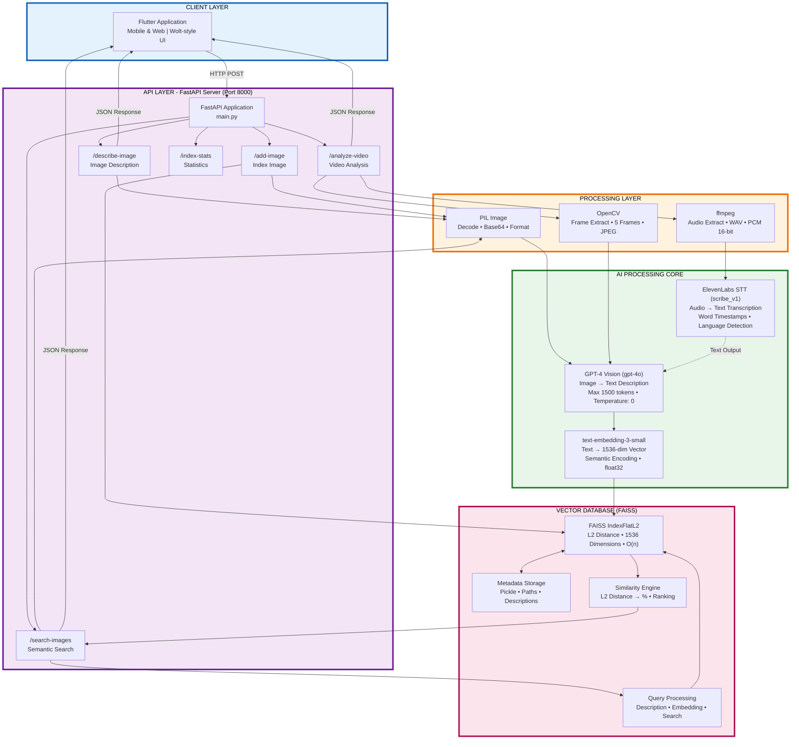

# AI-Powered Food Discovery Platform

An intelligent food discovery system that uses AI to analyze food images and videos, enabling semantic search and recommendations. Built with FastAPI backend and Flutter frontend.

## Project Overview

This platform combines computer vision, natural language processing, and vector search to create a powerful food discovery experience. Users can:

- **Upload food images** and get AI-generated descriptions
- **Search for similar dishes** using semantic matching
- **Analyze food videos** with frame-by-frame analysis and audio transcription
- **Discover restaurants and menu items** based on visual similarity

## Architecture

### Backend (FastAPI)
- **FastAPI** server running on port 8000
- **OpenAI GPT-4 Vision** for image analysis and description generation
- **OpenAI Embeddings** (text-embedding-3-small) for semantic search
- **ElevenLabs Speech-to-Text** for video audio transcription
- **FAISS** vector database for fast similarity search
- **OpenCV** for video frame extraction
- **ffmpeg** for audio extraction

### Frontend (Flutter)
- Cross-platform mobile and web application
- Wolt-style UI design
- Image upload and search interface
- Video upload and analysis
- Restaurant listings and recommendations

## System Diagrams

### Complete System Architecture



### Interactive Diagrams (HTML)

For interactive versions with clickable components and detailed information:

- **[`complete_system_diagram.html`](complete_system_diagram.html)** - Interactive version of the main diagram. Click any component for detailed information.
- **[`backend_diagram.html`](backend_diagram.html)** - Detailed backend architecture
- **[`backend_flow_diagram.html`](backend_flow_diagram.html)** - Data flow through the AI pipeline
- **[`video_analysis_diagram.html`](video_analysis_diagram.html)** - Video analysis pipeline
- **[`image_indexing_diagram.html`](image_indexing_diagram.html)** - Image indexing process
- **[`diagrams_index.html`](diagrams_index.html)** - View all diagrams in one place

### Documentation
- **[`README_DIAGRAMS.md`](README_DIAGRAMS.md)** - Diagram usage guide
- **[`DIAGRAMS_QUICKSTART.md`](DIAGRAMS_QUICKSTART.md)** - Quick start for diagrams
- **[`BACKEND_ARCHITECTURE_DIAGRAM.md`](BACKEND_ARCHITECTURE_DIAGRAM.md)** - Technical deep dive
- **[`BACKEND_CODE_FLOW.md`](BACKEND_CODE_FLOW.md)** - Code flow documentation
- **[`AI_DATA_TRANSFORMATIONS.md`](AI_DATA_TRANSFORMATIONS.md)** - AI data processing details

**View all diagrams**: Open [`diagrams_index.html`](diagrams_index.html) in your browser

## Quick Start

### Prerequisites
- Python 3.8+
- ffmpeg (for video analysis)
- OpenAI API key
- ElevenLabs API key (optional, for video transcription)

### Backend Setup

1. **Create virtual environment**
   ```bash
   python -m venv venv
   source venv/bin/activate  # On Windows: .\venv\Scripts\Activate.ps1
   ```

2. **Install dependencies**
   ```bash
   pip install -r requirements.txt
   ```

3. **Configure environment variables**
   ```bash
   cp env.example.txt .env
   # Edit .env and add your API keys
   ```

4. **Run the server**
   ```bash
   uvicorn main:app --reload
   ```

   Or use the Makefile:
   ```bash
   make run
   ```

5. **Access API documentation**
   - Swagger UI: http://localhost:8000/docs
   - ReDoc: http://localhost:8000/redoc

### Frontend Setup

See the Flutter app README in `copy_android/README.md` or `flutter2test/README.md`

## API Endpoints

### Image Operations

- **POST `/describe-image`** - Get AI description of uploaded image
- **POST `/add-image`** - Add image to searchable index (creates 5 embedding variations)
- **POST `/search-images`** - Find similar images using semantic search

### Video Operations

- **POST `/analyze-video`** - Complete video analysis:
  - Extracts 5 key frames
  - Analyzes each frame with GPT-4 Vision
  - Extracts audio and transcribes with ElevenLabs STT
  - Returns combined results

### Index Management

- **GET `/index-stats`** - Get FAISS index statistics
- **GET `/index-list`** - List all indexed images

## Technology Stack

### Backend
- **FastAPI** - Modern Python web framework
- **OpenAI API** - GPT-4 Vision and text embeddings
- **ElevenLabs API** - Speech-to-text transcription
- **FAISS** - Vector similarity search
- **OpenCV** - Video processing
- **PIL/Pillow** - Image processing
- **ffmpeg** - Audio extraction

### Frontend
- **Flutter** - Cross-platform framework
- **Dart** - Programming language

### AI Models
- **GPT-4 Vision (gpt-4o)** - Image to text description
- **text-embedding-3-small** - Text to 1536-dim vector
- **ElevenLabs STT (scribe_v1)** - Audio to text

## Project Structure

```
JUNCTION2025/
├── main.py                    # FastAPI application
├── requirements.txt           # Python dependencies
├── prompt.txt                 # GPT-4 system prompt
├── Makefile                  # Build commands
├── RUN_AND_TEST.md          # Testing guide
│
├── copy_android/             # Flutter application
│   ├── lib/                  # Dart source code
│   ├── android/              # Android configuration
│   └── ios/                  # iOS configuration
│
├── samples/                  # Sample images for testing
├── faiss_index.bin          # FAISS vector index (generated)
├── faiss_metadata.pkl       # Image metadata (generated)
│
└── *.html                    # System architecture diagrams
```

## Testing

### Test Image Description
```bash
curl -X POST "http://localhost:8000/describe-image" \
  -H "Content-Type: multipart/form-data" \
  -F "image=@samples/1.jpg"
```

### Test Video Analysis
```bash
curl -X POST "http://localhost:8000/analyze-video" \
  -H "Content-Type: multipart/form-data" \
  -F "video=@pizza.mp4"
```

See [`RUN_AND_TEST.md`](RUN_AND_TEST.md) for detailed testing instructions.

## Features

### Image Search
- **Semantic matching** - Find similar dishes by meaning, not just pixels
- **5-variation strategy** - Each image indexed with 5 different descriptions for better recall
- **Similarity scoring** - L2 distance converted to percentage similarity

### Video Analysis
- **Frame extraction** - Automatically extracts 5 evenly-spaced key frames
- **Visual analysis** - Each frame analyzed with GPT-4 Vision
- **Audio transcription** - Extracts and transcribes audio track
- **Combined results** - Merges visual and audio insights

### Vector Search
- **FAISS IndexFlatL2** - Fast exact similarity search
- **1536-dimensional vectors** - High-quality semantic representations
- **Metadata storage** - Image paths, descriptions, and variations stored separately

## Documentation

- **[PROJECT_OVERVIEW.md](PROJECT_OVERVIEW.md)** - Project concept and overview
- **[BACKEND_ARCHITECTURE_DIAGRAM.md](BACKEND_ARCHITECTURE_DIAGRAM.md)** - Technical architecture
- **[BACKEND_CODE_FLOW.md](BACKEND_CODE_FLOW.md)** - Code flow and function details
- **[AI_DATA_TRANSFORMATIONS.md](AI_DATA_TRANSFORMATIONS.md)** - AI processing pipeline
- **[RUN_AND_TEST.md](RUN_AND_TEST.md)** - Setup and testing guide

## Environment Variables

Required:
- `OPENAI_API_KEY` - Your OpenAI API key

Optional:
- `ELEVENLABS_API_KEY` - For video audio transcription

## Development

### Running the Server
```bash
make run
# or
uvicorn main:app --reload
```

### Upload Sample Images
```bash
make upload-samples
```

### Run Tests
```bash
make test
```

### Clean Generated Files
```bash
make clean
```

## Performance

- **Image description**: 2-5 seconds per image
- **Embedding generation**: 0.5-1 second
- **FAISS search**: <10ms for 1000 vectors
- **Video frame extraction**: 1-2 seconds for 5 frames
- **Audio transcription**: 5-15 seconds depending on length

## Contributing

1. Fork the repository
2. Create a feature branch
3. Make your changes
4. Submit a pull request

## License

This project is part of JUNCTION 2025 hackathon.

## Acknowledgments

- OpenAI for GPT-4 Vision and embeddings
- ElevenLabs for speech-to-text API
- Facebook AI Research for FAISS
- FastAPI and Flutter communities

---

**For detailed architecture diagrams, open [`complete_system_diagram.html`](complete_system_diagram.html) in your browser.**

